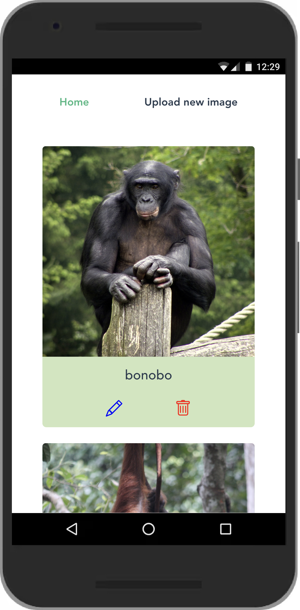
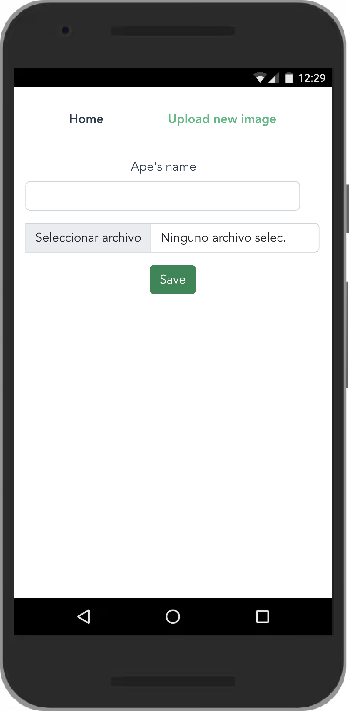
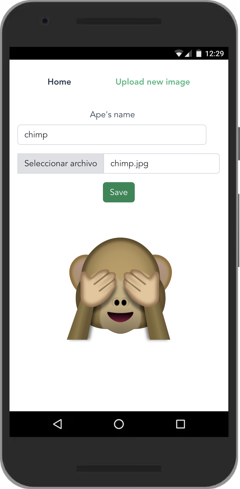
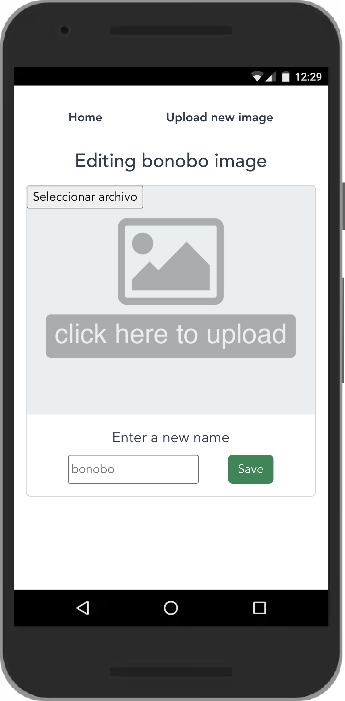

# Loving Apes App 🙉

Do you love our apes' cousins as much as I do? What's your favorite ape ? Mine are bonobos !
This is a basic app to register your favorites apes and monkeys' images, along with their names and, in the future, some information about them.






# Setting up the environment

The app has been designed as a monorepo, so the following commands can be run from the root directory.

## Installing dependencies

* `npm install` in order to install all the production and development dependecies, as defined in the `package.json` file.

## Setting up the database config

You will want to create a `.env` file in the `api` root directory where you can define the following variables:

```javascript
HOST = 127.0.0.1
DATABASE = [YOUR_DATABASE]
USER = [YOUR_MYSQL_USER_NAME]
PASSWORD = [YOUR_PASSWORD]
```

Also, when creating your data table, it should be called `apes` and have the following entries: `id`, `name`, and `url`, in order to be adapted to the config defined in the Servie Layer (`api/services/imageService.js`). Otherwise, you can edit this information in the mentioned file.

# Development environment

## Bootstraping the project

As mentioned before, being this a monorepo, you can run the building commands from the root directory. You would like to open two different terminals, one for the api and the other one for the app.

In order to build both projects:

* `npm run build:api` 
* `nom run build:app`

And to bootstrap the app and watch it working on your web:

* `npm run start:api`
* `npm run start:app`

## Testing the app

Currently, only the API is tested. In order to run the tests, you should be placed in the `api` package and execute:

`npm run test`

❗️In order to test the `updateImage` function, you should have previously pushed the object you want to modify.

# About the chosen architecture

The followed architecture to build the API was the <strong> 3 Layer Architecture </strong>. It consists of three instances to interact between the router and the database.


Source: "REST API Design. Best Practices", from FreeCodeCamp.

After some days of research, I wanted to try this framework for two reasons: I had never tried it before and it seemed easy. It turned out to be not that easy to build, but it was due more to ignorance of the tech stack than the architecture, as I'm going to explain later on this article.

The basic idea is that the API methods that handle the HTTP resquests (Controller) to be separated from those functions handling the requests to the database and containing business logic (Service Layer), and these, in turn, from the connection config to the database (Data Access Layer).

In the `api` package, we can se clearly the distinction among these three layers.

The same was attempted in the frontend. In this case, I had the enormous help from the Vue framework. Their state management system, Vuex, already incorporates the Service Layer (these methods are found in the `store` folder).

# Conventional commits

As its name points out, they refer to a convention on how to write your commits. The benefit, as explained in the official website is that <em> "it provides an easy set of rules for creating an explicit commit history"</em> 
I've followed this protocol all along the project, as can be seen in the commit history.

# Tech stack

I have used MySQL, Node.js and Express to build the API, and Vue to make the frontend. The reason to chose Node.js and the Express framework is the same than the architecture: I had never work with them before. 

The fact that they belong to the JS ecosystem helped me a lot, since JS is my native programming language.

# 🚀 Things to improve
* Handle with more detailed status the HTTP responses
* Incorporate tests to the frontend
* Improve the visual design of the app
* Generate a CHANGELOG of the commit history
* Adapt to the Desktop version ! (prioritized the mobile version)